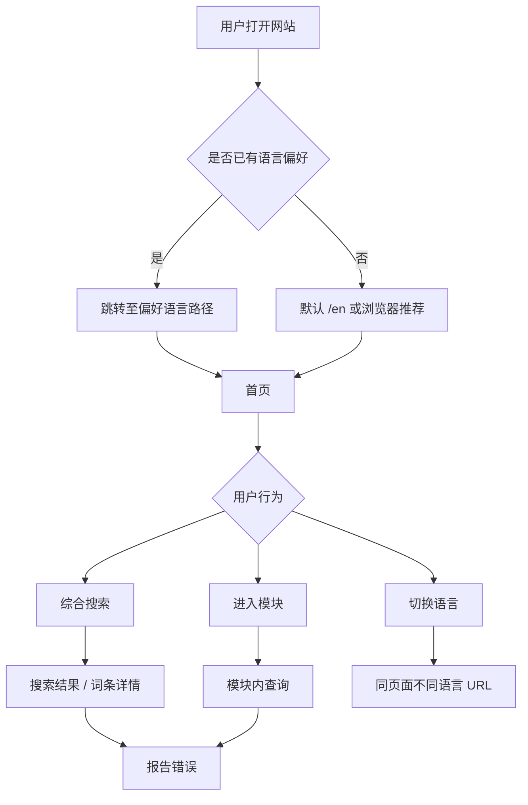

# 用户交互流程（User Flows）

> 文档版本：1.0  
> 最后更新：2026-08-03  
> 项目：Korean Reference

---

## 1. 流程总览



---

## 2. 首次进入网站

```text
用户打开网站（/ 或任意路径）
    ↓
检查 localStorage 中的语言偏好
    ↓
├─ 有偏好 → 若当前 URL 语言不匹配，重定向至对应语言路径
└─ 无偏好 → 默认进入 /en（可选：根据浏览器语言显示一次性推荐，不强制）
    ↓
显示首页（Hero + 搜索框 + 模块入口）
    ↓
用户可开始搜索或选择模块
```

### 规则

| 规则 | 说明 |
|------|------|
| 默认语言 | 英文（en） |
| 偏好存储 | `localStorage`（键名在架构文档中定义） |
| 偏好优先级 | 用户手动选择 > 默认英文 |
| 根路径 | `/` → 稳定跳转或推荐至 `/en` |
| 复杂度 | 不做复杂自动语言判断 |

---

## 3. 语言切换流程

```text
用户点击语言下拉（English / 简体中文 / 日本語）
    ↓
选择目标语言
    ↓
系统将当前页面路径中的语言段替换
    例：/en/entries/deutda → /zh/entries/deutda
    ↓
保存语言偏好至 localStorage
    ↓
加载目标语言界面文本
    ↓
加载目标语言知识内容
    ↓
├─ 当前语言内容存在 → 正常展示
├─ 当前语言缺失、英文存在 → 展示英文 + 回退标记
└─ 英文也缺失 → 显示「内容准备中」
```

### 约束

- 切换后**不**返回首页
- 切换后**不**清空搜索条件或筛选状态
- URL 必须同步变化（利于分享与 SEO）
- Slug 保持不变，仅语言前缀变化

### 回退标记（三语界面文案）

| 界面语言 | 标记文案 |
|----------|----------|
| en | English content shown because this translation is not yet available. |
| zh | 当前翻译尚未完成，以下为英文内容。 |
| ja | この翻訳は未完了のため、英語版を表示しています。 |

---

## 4. 综合查询流程

```text
用户进入首页或综合查询页
    ↓
在搜索框输入查询词
    ↓
输入达到触发条件（韩文/汉字 ≥1 字符，其他 ≥2 字符）
    ↓
防抖 200–300ms 后请求搜索建议
    ↓
显示最多 8 条建议（词条、词性、释义、类型、汉字/发音）
    ↓
用户操作：
├─ 键盘上下 + Enter → 进入选中项
├─ 点击建议项 → 进入详情
├─ Esc → 关闭建议
└─ 直接提交搜索 → 进入搜索结果页
    ↓
搜索结果页按类型分组展示
    ↓
用户点击条目 → 进入详情页（长滚动 + 锚点导航）
    ↓
浏览：概要 / 发音 / 音变 / 变形 / 汉字 / 例句 / 相关内容
    ↓
可选：点击锚点跳转、复制内容、分享 URL、报告错误
```

### 无结果流程

```text
搜索无完全匹配
    ↓
按优先级展示：部分匹配 → 释义匹配 → 相似词
    ↓
若仍无结果 → 空状态页
    ↓
空状态提供：
├─ 检查拼写建议
├─ 尝试搜索原形提示
├─ 前往具体模块链接
└─ 提交内容建议或错误反馈入口
```

### 跨模块结果分组

```text
综合搜索结果
├── 词条（Entries）
├── 音变规则（Sound Rules）
├── 用言变形（Conjugation）
├── 汉字词（Hanja Entries）
└── 习语（Idioms）
```

---

## 5. 音变查询流程

### 5.1 按规则浏览

```text
用户进入 /{lang}/sound-change
    ↓
浏览平铺规则列表
    ↓
可选：按分类标签筛选（连音、鼻音化、流音化…）
    ↓
可选：按难度或常用程度排序
    ↓
点击规则 → 进入规则详情页
    ↓
查看：
├─ 可视化分步对比
├─ 文字说明与条件表格
├─ 例词与例句
├─ 例外与注意事项
└─ 相关音变规则链接
    ↓
可选：跳转至触发该规则的词条
```

### 5.2 从词条查看音变

```text
用户搜索词条 → 进入词条详情
    ↓
在「音变」区块查看书写形式 vs 实际发音
    ↓
查看该词触发的音变规则列表
    ↓
点击规则 → 进入音变规则详情页
```

---

## 6. 用言变形查询流程

```text
用户进入 /{lang}/conjugation
    ↓
输入原形或搜索选择已收录用言
    ↓
选择变形条件：
├─ 目标词尾
├─ 时态
├─ 礼貌等级
├─ 肯定 / 否定
└─ 陈述 / 疑问 / 命令等句型
    ↓
系统查找词条及相关规则
    ↓
├─ 找到可靠结果 → 展示变形结果
│   ├─ 原形、词干、结果形式
│   ├─ 静态编号步骤
│   ├─ 使用规则名称
│   ├─ 不规则标记（若有）
│   ├─ 注意事项
│   └─ 例句及三语解释
└─ 未收录 → 明确提示「暂未收录此用言或变形形式」
```

### 不规则用言展示

```text
检测到不规则用言
    ↓
明确标记：
├─ 不规则类型（如 ㄷ不规则、ㅂ不规则、르不规则…）
├─ 发生变化的位置
├─ 正确变形结果
└─ 与规则用言变形的区别说明
```

---

## 7. 汉字词查询流程

```text
用户进入 /{lang}/hanja
    ↓
输入韩文词或汉字
    ↓
├─ 输入完整词 → 返回匹配汉字词列表
└─ 输入单个汉字 → 返回所有已收录的相关韩语汉字词（基础反查）
    ↓
用户选择条目 → 进入汉字词详情
    ↓
查看：
├─ 韩文词形、汉字、发音、词性
├─ 三语释义
├─ 逐字解释表格（字 | 读音 | 基本意义）
├─ 常见搭配、例句
├─ 同音汉字词、相关词汇
└─ 频率 / 难度标签
```

---

## 8. 习语查询流程

```text
用户进入 /{lang}/idioms
    ↓
选择方式：
├─ 搜索框输入习语
└─ 浏览主题分类（日常会话、感情与态度…）
    ↓
查看习语列表
    ↓
点击习语 → 进入详情页
    ↓
查看：
├─ 习语原文
├─ 字面意义 vs 实际意义（桌面两栏 / 移动上下）
├─ 三语解释
├─ 使用场景、语体与正式程度
├─ 例句及翻译
├─ 相近表达
└─ 容易误用的情况
```

---

## 9. 错误反馈流程

```text
用户在内容页
    ↓
触发入口：
├─ 正文底部「报告错误」按钮
└─ 页面右侧/右下角轻量反馈按钮
    ↓
打开反馈表单（模态或抽屉）
    ↓
自动填充：
├─ 关联内容 ID
├─ 内容类型
└─ 当前页面 URL
    ↓
用户选择问题类型 + 填写描述（10–1000 字符）
    ↓
Honeypot 字段（对用户不可见）
    ↓
客户端基础验证
    ↓
提交至服务端 API
    ↓
服务端验证：
├─ 字段完整性
├─ 频率限制（同 IP/标识 每分钟 ≤1 次）
└─ Honeypot 为空
    ↓
├─ 成功 → 写入 feedback 表 → Toast 成功提示 → 关闭表单
└─ 失败 → 表单内显示错误信息
```

### 反馈后状态

- 正式词条内容**不变**
- 用户**不可**查看处理进度
- 管理员在 Supabase 后台查看并处理

---

## 10. 内容维护流程（管理员）

```text
管理员登录 Supabase 后台
    ↓
查看 / 编辑数据（词条、规则、翻译、例句、习语…）
    ↓
设置发布状态：
├─ draft → 网站不可见
├─ published → 网站公开读取
└─ archived → 停止公开，保留数据
    ↓
保存后网站下次请求即读取新数据（通常无需重新部署）
    ↓
查看用户错误反馈 → 人工修正 → 更新内容
```

**需重新部署的情况：** 网站代码、页面结构、查询逻辑变更。

---

## 11. 开发与部署流程

```text
需求与文档确认（当前阶段）
    ↓
Demo 开发（Mock 数据 + 页面交互）
    ↓
本地运行与测试
    ↓
Git Commit → 推送 GitHub
    ↓
Vercel 自动构建（Preview / Production）
    ↓
电脑与手机验收
    ↓
接入 Supabase（Migration + Seed + RLS）
    ↓
验证 Vercel ↔ Supabase 连接
    ↓
替换 Mock 为数据库读取
    ↓
正式 MVP 上线
    ↓
持续：内容扩充 + 迭代 + 文档更新
```

---

## 12. 移动端特有流程

### 12.1 导航

```text
移动端顶部：
[Logo/站名]                    [搜索图标] [汉堡菜单]
    ↓
汉堡菜单展开：
├─ 首页
├─ 综合查询
├─ 音变
├─ 用言变形
├─ 汉字词
├─ 习语
├─ 关于
├─ 语言切换（下拉）
└─ 主题切换（若已实现）
```

### 12.2 词条详情

```text
移动端词条页顶部：
[返回] [词条名] [目录按钮]
    ↓
点击目录按钮 → 展开锚点列表
    ↓
选择锚点 → 滚动至对应区块
```

### 12.3 表格处理

汉字逐字解释等表格在移动端转为纵向卡片或可横向滚动，避免内容被截断不可读。

---

## 13. 主题切换流程（第二优先级）

```text
用户点击主题切换（跟随系统 / 浅色 / 深色）
    ↓
保存偏好至 localStorage
    ↓
应用 CSS 变量主题
    ↓
若 prefers-reduced-motion → 禁用非必要动画
```

**注意：** 浅色模式为第一优先级；深色模式不得阻塞核心功能开发。
