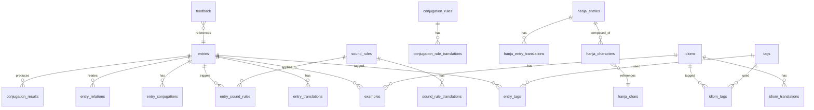

# 数据模型（Data Model）

> 文档版本：1.2  
> 最后更新：2026-08-07（Phase 6A.4 最终静态修订完成，可进入 Phase 6B 本地实跑）  
> 项目：Korean Reference  
> 数据库：Supabase PostgreSQL

---

## 1. 建模原则

### 1.1 三类内容分离

| 类型 | 用途 | 示例 |
|------|------|------|
| **Rules（规则）** | 音变条件、变形逻辑、不规则变化、适用范围 | `sound_rules`, `conjugation_rules` |
| **Content（内容）** | 词条、汉字、习语、例句、标签、关系 | `entries`, `idioms`, `examples` |
| **Translations（翻译）** | 各语言解释、例句翻译、规则说明 | `entry_translations`, `rule_translations` |

### 1.2 通用字段约定

- 主键：UUID（`id`），使用 `gen_random_uuid()` 或 Supabase 默认
- 对外 URL：可读 `slug`（拉丁字母，稳定不变）
- 发布状态：`draft` | `in_review` | `published` | `archived`（公开 API 仅 `published`）
- 翻译状态（翻译表）：`draft` | `in_review` | `published` | `needs_revision`
- 时间戳：`created_at`, `updated_at`, `published_at`（nullable）
- 所有正式表启用 RLS（Row Level Security）

### 1.3 多语言存储

**禁止**将中/英/日内容混写在同一长文本字段。

推荐模式：主表存语言无关字段 + 翻译表存各语言内容。

---

## 2. 实体关系概览



---

## 3. 核心表结构

### 3.1 entries（词条）

| 字段 | 类型 | 说明 |
|------|------|------|
| id | uuid | PK |
| slug | text | 唯一，URL 用，如 `deutda` |
| headword_ko | text | 韩文标准词形 |
| headword_normalized | text | 标准化形式（搜索用） |
| part_of_speech | text | 词性，如 `verb`, `noun`, `adjective` |
| pronunciation | text | 发音（韩文或描述） |
| romanization | text | RR 主罗马字（可选；阶段 4.1 起可搜索） |
| romanization_aliases | text[] | 审核过的备用罗马字（可选） |
| irregular_type | text | 不规则类型（nullable）：`ㄷ` `ㅂ` `ㅅ` `ㅎ` `르` `러` `여` `우` |
| etymology_type | text | 词源（nullable）：`native` `sino_korean` `loanword` `hybrid` `unknown` |
| hanja_text | text | 对应汉字（nullable） |
| status | text | `draft` / `in_review` / `published` / `archived` |
| frequency_level | text | `high` / `medium` / `low`（nullable） |
| difficulty_level | text | `beginner` / `intermediate` / `advanced`（nullable） |
| created_at | timestamptz | |
| updated_at | timestamptz | |
| published_at | timestamptz | nullable |

**索引：** `slug`（unique）, `headword_ko`, `headword_normalized`, `status`, `part_of_speech`

### 3.2 entry_translations（词条翻译）

| 字段 | 类型 | 说明 |
|------|------|------|
| id | uuid | PK |
| entry_id | uuid | FK → entries |
| locale | text | `zh` / `en` / `ja` |
| definition | text | 主要释义 |
| notes | text | 补充说明（nullable） |
| usage_notes | text | 用法说明（nullable） |
| created_at | timestamptz | |
| updated_at | timestamptz | |

**约束：** `(entry_id, locale)` unique

### 3.3 examples（例句）

| 字段 | 类型 | 说明 |
|------|------|------|
| id | uuid | PK |
| entry_id | uuid | FK → entries（nullable） |
| idiom_id | uuid | FK → idioms（nullable） |
| sound_rule_id | uuid | FK → sound_rules（nullable） |
| sentence_ko | text | 韩文例句 |
| sort_order | int | 排序 |
| status | text | 发布状态 |
| created_at | timestamptz | |
| updated_at | timestamptz | |

### 3.4 example_translations（例句翻译）

| 字段 | 类型 | 说明 |
|------|------|------|
| id | uuid | PK |
| example_id | uuid | FK → examples |
| locale | text | `zh` / `en` / `ja` |
| translation | text | 翻译 |
| created_at | timestamptz | |
| updated_at | timestamptz | |

**约束：** `(example_id, locale)` unique

---

## 4. 音变相关表

### 4.1 sound_rules（音变规则）

| 字段 | 类型 | 说明 |
|------|------|------|
| id | uuid | PK |
| slug | text | URL 用 |
| name_ko | text | 韩文规则名 |
| category | text | 分类 code（见 §14.1） |
| difficulty | int | 难度 **1–5**（nullable）；URL 筛选 tier 由应用层映射 |
| frequency | int | 常用程度 1–5（nullable） |
| sort_order | int | 列表排序 |
| status | text | 发布状态 |
| created_at | timestamptz | |
| updated_at | timestamptz | |
| published_at | timestamptz | |

### 4.2 sound_rule_translations（音变规则翻译）

| 字段 | 类型 | 说明 |
|------|------|------|
| id | uuid | PK |
| sound_rule_id | uuid | FK |
| locale | text | `zh` / `en` / `ja` |
| title | text | 规则标题 |
| summary | text | 简要说明 |
| explanation | text | 详细解释 |
| conditions | text | 适用条件 |
| exceptions | text | 例外与注意事项 |
| created_at | timestamptz | |
| updated_at | timestamptz | |

### 4.3 sound_rule_steps（音变分步展示）

| 字段 | 类型 | 说明 |
|------|------|------|
| id | uuid | PK |
| sound_rule_id | uuid | FK |
| step_order | int | 步骤序号 |
| before_text | text | 变化前 |
| after_text | text | 变化后 |
| label | text | 步骤标签（nullable） |
| created_at | timestamptz | |

### 4.4 entry_sound_rules（词条-音变关联）

| 字段 | 类型 | 说明 |
|------|------|------|
| entry_id | uuid | FK → entries |
| sound_rule_id | uuid | FK → sound_rules |
| context_note | text | 在该词中的说明（nullable） |

**约束：** `(entry_id, sound_rule_id)` unique

---

## 5. 用言变形相关表

### 5.1 conjugation_rules（变形规则）

| 字段 | 类型 | 说明 |
|------|------|------|
| id | uuid | PK |
| slug | text | |
| rule_type | text | **已废弃（Phase 5.1）** — 改用 `is_irregular` + `irregular_type` |
| is_irregular | boolean | 是否不规则规则 |
| irregular_type | text | nullable；与 entries.irregular_type 相同 code 集 |
| name_ko | text | 韩文名称 |
| is_irregular | boolean | 是否不规则规则 |
| status | text | |
| created_at | timestamptz | |
| updated_at | timestamptz | |

### 5.2 conjugation_rule_translations

| 字段 | 类型 | 说明 |
|------|------|------|
| id | uuid | PK |
| conjugation_rule_id | uuid | FK |
| locale | text | |
| title | text | |
| explanation | text | |
| created_at | timestamptz | |
| updated_at | timestamptz | |

### 5.3 conjugation_results（已收录变形结果）

| 字段 | 类型 | 说明 |
|------|------|------|
| id | uuid | PK |
| entry_id | uuid | FK → entries |
| conjugation_rule_id | uuid | FK（nullable） |
| target_form | text | 复合 form code（见 §14.3），如 `present_polite` |
| result_ko | text | 变形结果 |
| steps_json | jsonb | 变形步骤数组 |
| is_irregular | boolean | |
| irregular_note | text | nullable |
| status | text | |
| created_at | timestamptz | |
| updated_at | timestamptz | |

**steps_json 示例：**

```json
[
  { "order": 1, "description_key": "remove_da" },
  { "order": 2, "description_key": "identify_irregular_ㄷ" },
  { "order": 3, "description_key": "ㄷ_to_ㄹ" },
  { "order": 4, "description_key": "attach_eoyo" },
  { "order": 5, "description_key": "result_deureoyo" }
]
```

步骤描述文本存翻译表或通过 i18n 键映射。

### 5.4 conjugation_forms（变形形式选项）

| 字段 | 类型 | 说明 |
|------|------|------|
| id | uuid | PK |
| form_key | text | 唯一标识，如 `present_polite` |
| sort_order | int | |
| created_at | timestamptz | |

### 5.5 conjugation_form_translations

| 字段 | 类型 | 说明 |
|------|------|------|
| id | uuid | PK |
| conjugation_form_id | uuid | FK |
| locale | text | |
| label | text | 显示名称，如「现在时敬语」 |
| created_at | timestamptz | |

---

## 6. 汉字词相关表

### 6.1 hanja_entries（汉字词）

| 字段 | 类型 | 说明 |
|------|------|------|
| id | uuid | PK |
| slug | text | |
| word_ko | text | 韩文词形 |
| hanja_text | text | 对应汉字 |
| pronunciation | text | |
| part_of_speech | text | |
| entry_id | uuid | FK → entries（nullable，关联综合词条） |
| status | text | |
| created_at | timestamptz | |
| updated_at | timestamptz | |

### 6.2 hanja_entry_translations

| 字段 | 类型 | 说明 |
|------|------|------|
| id | uuid | PK |
| hanja_entry_id | uuid | FK |
| locale | text | |
| definition | text | |
| notes | text | 段落补充说明 |
| created_at | timestamptz | |
| updated_at | timestamptz | |

### 6.3 hanja_characters（汉字字表，用于单字反查）

| 字段 | 类型 | 说明 |
|------|------|------|
| id | uuid | PK |
| character | text | 单个汉字 |
| reading_ko | text | 韩语读音（在该词中） |
| meaning | text | 基本意义 |
| hanja_entry_id | uuid | FK → hanja_entries |
| sort_order | int | 在词中的顺序 |
| created_at | timestamptz | |

**索引：** `character`（用于单字反查）

---

## 7. 习语相关表

### 7.1 idioms（习语）

| 字段 | 类型 | 说明 |
|------|------|------|
| id | uuid | PK |
| slug | text | |
| idiom_ko | text | 习语原文 |
| idiom_normalized | text | 搜索用 |
| register | text | `formal` / `informal` / `neutral` |
| status | text | |
| created_at | timestamptz | |
| updated_at | timestamptz | |
| published_at | timestamptz | |

### 7.2 idiom_translations

| 字段 | 类型 | 说明 |
|------|------|------|
| id | uuid | PK |
| idiom_id | uuid | FK |
| locale | text | |
| literal_meaning | text | 字面意义 |
| actual_meaning | text | 实际意义 |
| explanation | text | 详细解释 |
| usage_context | text | 使用场景 |
| common_mistakes | text | 易误用说明 |
| created_at | timestamptz | |
| updated_at | timestamptz | |

---

## 8. 标签与关系

### 8.1 tags

| 字段 | 类型 | 说明 |
|------|------|------|
| id | uuid | PK |
| slug | text | |
| tag_type | text | `entry` / `idiom` / `sound_rule` / `general` |
| created_at | timestamptz | |

### 8.2 tag_translations

| 字段 | 类型 | 说明 |
|------|------|------|
| id | uuid | PK |
| tag_id | uuid | FK |
| locale | text | |
| label | text | |
| created_at | timestamptz | |

### 8.3 关联表

| 表名 | 字段 | 说明 |
|------|------|------|
| entry_tags | entry_id, tag_id | 词条标签 |
| idiom_tags | idiom_id, tag_id | 习语主题分类 |
| entry_relations | source_entry_id, target_entry_id, relation_type | 相关词、易混淆词 |
| idiom_relations | source_idiom_id, target_idiom_id, relation_type | 相近表达 |
| sound_rule_relations | source_rule_id, target_rule_id | 相关音变规则 |

**relation_type 示例（Phase 5.1 类型已对齐，Mock 尚未全面使用）：** `related`, `synonym`, `antonym`, `confusable`, `see_also`, `derived_from`, `variant_of`（词条）；音变/习语见 `src/lib/types/relations.ts`

---

## 9. 错误反馈

### 9.1 feedback

| 字段 | 类型 | 说明 |
|------|------|------|
| id | uuid | PK |
| target_kind | text | 见 `FeedbackTargetKind`（`src/lib/types/feedback.ts`） |
| target_id | uuid | 关联内容 ID（nullable） |
| page_url | text | 提交时页面 URL |
| category | text | 见 `FeedbackCategory` |
| description | text | 用户描述（10–1000 字符） |
| status | text | `new` / `reviewing` / `resolved` / `rejected` / `duplicate` / `spam` |
| client_identifier | text | IP 哈希或匿名标识（用于频率限制） |
| created_at | timestamptz | |
| updated_at | timestamptz | |

**注意：** 反馈表只允许 INSERT（匿名用户），不允许公开 SELECT。

---

## 10. 搜索支持

### 10.1 搜索字段策略

| 实体 | 可搜索字段 |
|------|-----------|
| entries | headword_ko, headword_normalized, romanization, romanization_aliases, 各 locale definition |
| sound_rules | name_ko, 各 locale title/summary |
| hanja_entries | word_ko, hanja_text, romanization, romanization_aliases, 各 locale definition |
| idioms | idiom_ko, idiom_normalized, 各 locale actual_meaning |
| hanja_characters | character |

### 10.2 第一版搜索实现

- PostgreSQL `ILIKE` / `LIKE` 前缀与部分匹配
- 标准化函数（去空格、统一 Unicode 形式）
- 分类与词性筛选
- 结果按匹配类型分组与排序

后续可升级：全文搜索（`tsvector`）、专用搜索服务。

### 10.3 已收录变形形式搜索

在 `conjugation_results.result_ko` 上建索引，综合搜索可通过变形结果反查 `entry_id`。

---

## 11. RLS 策略概要

| 表 | 匿名用户（anon） |  service_role |
|----|------------------|---------------|
| 内容表（entries, rules…） | SELECT where status = 'published' | 全部 |
| 翻译表 | SELECT（关联 published 内容） | 全部 |
| feedback | INSERT only | SELECT / UPDATE |
| draft / archived | 不可读 | 可读 |

**原则：**

- 浏览器只使用 `anon` key
- `service_role` key 仅服务端环境变量
- 不通过隐藏 API 路由绕过 RLS

---

## 12. Migration 与 Seed

### 12.1 Migration

所有数据库结构变更通过 Supabase Migration 文件记录，命名示例：

```text
supabase/migrations/20260803000001_initial_schema.sql
supabase/migrations/20260803000002_rls_policies.sql
supabase/migrations/20260803000003_search_indexes.sql
```

### 12.2 开发 Seed 内容

| 类型 | 数量 | 特殊案例 |
|------|------|----------|
| 词条 | 10–20 | 含 draft、archived、不规则 |
| 音变规则 | 5 | 含分步展示 |
| 用言变形 | 5 | 含不规则步骤 |
| 汉字词 | 5 | 含单字反查 |
| 习语 | 5 | 含各主题分类 |
| 翻译 | 三语 | 含缺失翻译（测回退） |

Seed 文件：`supabase/seed.sql` 或独立 seed 脚本。

---

## 13. 数据导入模板

维护者应使用 CSV / JSON 模板导入，模板字段须与本文档一致。模板文件在开发阶段创建：

```text
scripts/templates/
  entries.template.csv
  entry_translations.template.csv
  sound_rules.template.csv
  idioms.template.csv
  ...
```

字段说明见 [10-content-guidelines.md](./10-content-guidelines.md)。

---

## 14. Canonical Code（Phase 5.1）

TypeScript 权威定义位于 `src/lib/constants/` 与 `src/lib/types/`。**本阶段不写 Migration SQL。**

### 14.1 音变分类 `sound_change.category`

`liaison` · `nasalization` · `liquidization` · `tensification` · `aspiration` · `h_changes` · `batchim` · `other`

### 14.2 音变难度

- 数据库存 **整数 1–5**（`sound_rules.difficulty`）
- URL/UI tier：`beginner`（1–2）· `intermediate`（3）· `advanced`（4–5）

### 14.3 用言形式 `conjugation_results.target_form`

复合 code（第一版不拆独立 tense / speech_level 列）：

`present_polite` · `past_polite` · `present_formal` · `past_formal` · `present_informal` · `propositive`

### 14.4 习语

- **categories**：多值数组，非单一 category
- 可选值：`daily` · `emotion` · `relationship` · `work-study` · `body` · `animal` · `formal` · `colloquial`
- **register**：`formal` · `informal` · `neutral`（与 category 中 `formal` 语义不同）

### 14.5 第一版暂不纳入数据库 CHECK 的维度

- `idiom_type`
- `tone`
- 独立 `tense` / `speech_level` / `polarity` / `honorific` / `sentence_type`（暂由 form code 隐含）

### 14.6 来源与反馈类型

见 `src/lib/types/source.ts`、`src/lib/types/feedback.ts`（类型已定义，UI/API 未实现）。

---

## 15. Supabase Migration（Phase 6A → 6A.4）

| 项目 | 状态 |
|------|------|
| Migration 静态审查 | ✅ 6A.4 完成 |
| 下一步 | Phase 6B 本地 `db reset` + Adapter |
| 远程 Supabase | ❌ 未连接 |
| Migration 执行 | ❌ 尚未执行 |

**6A.4 要点：**

- Feedback 删除：同 UPDATE 设置 `target_was_deleted` 并清空 FK
- `examples.provenance_type`（来源方式）≠ `sources.source_type`（文献类型）
- Hanja term 发布要求 linked character/reading 为 published
- `entry_examples` 支持同例句关联多 sense
- Sound change / conjugation rule 英文发布需 description / explanation

详见 `supabase/MIGRATION_REVIEW.md`。
